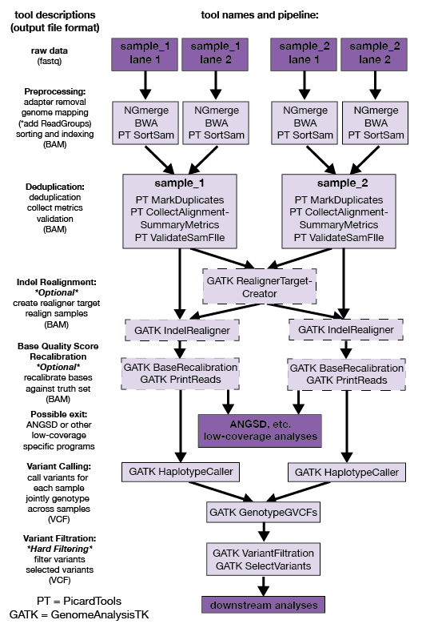
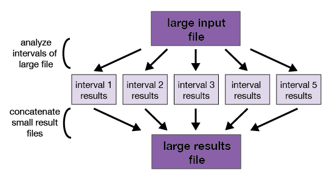

Title: Whole-genome resquencing for population genomics (Fastq to VCF)
Date: 2018-01-10
Category: Tutorials
Author: Allison Shultz
Tags: Genomics, Next-gen Sequencing, Whole Genome Resequencing, GATK
Summary:  This tutorial will help users go from raw FASTQ sequencing files to analysis-read VCF files.

## Table of Contents
[Whole-genome Pop Gen Sequencing Overview](#overview)<br>
[Experimental Design](#design)<br>
[Compute Access / Odyssey](#odyssey)<br>
[Sequence Reads](#reads)<br>
[Quality Control](#qc)<br>
[Preprocessing](#preprocess)<br>
[Indel Realignment](#realignment)<br>
[Base Quality Score Recalibration](#bqsr)<br>
[Variant Calling](#variantcalling)<br>
[Data Filtering](#filtering)<br>
[Next Steps](#next)<br>
[References](#references)<br>

## Whole-genome resequencing population genomics overview <a name="overview"></a>

Population genetics can be used to identify genetic variation within and between populations, and with DNA sequencing becoming less expensive, more researchers are turning to whole-genome resequencing to understand genome-wide variation. The objective of this tutorial is to familiarize users with the process of obtaining analysis-ready VCF files from population genomic whole-genome resequencing data. The tutorial is based on the [GATK's best practices pipeline for Germline SNP and Indel Discovery](https://software.broadinstitute.org/gatk/best-practices/bp_3step.php?case=GermShortWGS), however, geared toward non-human organisms. We also address low-coverage whole-genome resequencing data in the tutorial, as we expect this data type to be common for our users. In addition to [fastq sequencing data files](#reads), it is also necessary to have a reference genome fasta file for this pipeline. If the reference exists but you don't have it in hand, you can download the fasta file from [that organism's genome page from NCBI](https://www.ncbi.nlm.nih.gov/genome/browse/#!/overview/).

## Experimental design <a name="design"></a>

There are numerous preparation methods, (e.g. [Nextera](https://www.illumina.com/products/by-type/sequencing-kits/library-prep-kits/nextera-dna.html), [Kapa](http://sequencing.roche.com/en/products-solutions/by-category/library-preparation/dna-library-preparation.html) ) to construct sequencing libraries from DNA extraction. These laboratory methods are beyond the scope of this tutorial. However, we will address a few aspects of study design when designing an experiment.

### 1. Pooled sequencing vs. individually barcoding samples

One decision researchers need to make when designing their resequencing experiments is whether to pool unbarcoded individuals together in a single sequencing library (termed **Pool-seq**), or to individually barcode each individual, enabling researchers to demultiplex these individuals for downstream analyses even if they are pooled for sequencing itself. There are pros and cons to both approaches, but essentially the decision comes down to cost and research objective. Many papers have been written about the pros and cons of pooled sequencing, and [Schlötterer et al. 2014](https://www.nature.com/articles/nrg3803) provides a nice review and comparison with other methods. Briefly, we outline some of the pros and cons below:

* **Pooled sequencing**: The main advantage for this approach is cost savings on library preparation. If large sample sizes are required for the research objectives, library preparation costs can quickly become a limiting factor. By pooling large numbers of individuals in a single population, researchers would only need to prepare a single sequencing library per pool. However, this method has limitations on possible downstream analyses and potential sequencing biases. This method can yield estimates of allele frequencies from a pooled population, but few statistics beyond that (e.g. haplotype information, linkage disequilibrium). Pool-seq also works best when large numbers of individuals (>40) are pooled together, with pools on the order of hundreds or thousands of individuals being ideal. One of the biggest drawbacks of Pool-seq is that unequal individual representation will produce biases in allele frequency estimates, and without barcodes it is impossible to know if this has occurred. This is less likely to happen with larger sample sizes.

* **Individually barcoded sequencing**: The main advantage of this approach is that individually barcoding reads means that variants can be called for individuals, and with sufficient coverage (see below), it is possible to obtain haplotype information or other useful statistics. As mentioned above, the main drawback of this method is the cost of library preparation. This is increasingly less expensive however, either because of new kits becoming available, or the ability to split library preparation reagents into multiple microreactions (e.g. [Baym et al. 2015](https://www.ncbi.nlm.nih.gov/pmc/articles/PMC4441430/)). Therefore, in the tutorial, we focus on methods for creating VCFs from individually barcoded samples.

### 2. Sample sizes

Determining how many individuals you need to sequence depends on what types of analysis you wish to conduct downstream. If the objective of the study is to describe population structure and genetic diversity, very few individuals per population are needed because whole-genome sequencing provides so much information per individual (e.g. [Nazareno et al. 2017](http://onlinelibrary.wiley.com/doi/10.1111/1755-0998.12654/full)). If the goal of the study is to perform detailed demographic inference (e.g. with the site frequency spectrum via dadi or fastsimcoal2), small numbers of individuals may be sufficient for detecting older events or testing different models, but larger numbers of individuals may be necessary to detect recent events or estimate parameters (e.g. [Robinson et al. 2014](https://bmcevolbiol.biomedcentral.com/articles/10.1186/s12862-014-0254-4)).

Identifying allele frequency shifts at specific sites (e.g. looking for Fst outliers) or GWAS-types of analyses require larger population sizes to have enough power to detect significant differences with FDR corrections for millions of sites.

### 3. Sequencing depth

Ideally, to confidently call variants from whole genome resequencing data, diploid organisms should be sequenced to 30x coverage. However, due to limited budgets and different study goals, it is often possible to sequence to much lower coverage. For many population genomic goals, given a set amount of sequencing to work with (e.g. 100x coverage of the target genome), it is often more advantageous to sequence more individuals (100 individuals to 1x coverage), to more accurately infer population genetic parameters ([Buerkle and Gompert 2012](http://onlinelibrary.wiley.com/doi/10.1111/mec.12105/abstract)). Because of limited budgets despite falling sequencing costs, an increasing number of tools are available to make use of low-coverage whole-genome resequencing for population genomic inference. For example, the [ANGSD](http://www.popgen.dk/angsd/index.php/ANGSD) and [NGSTools](https://github.com/mfumagalli/ngsTools) packages allow one to calculate site frequency spectra, diversity statistics, PCA, and admixture analysis among others based entirely on genotype likelihood scores. Other packages, like [MAPGD](https://github.com/LynchLab/MAPGD), allow one to calculate linkage disequilibrium and relatedness using genotype likelihoods. By not actually calling genotypes, and instead inferring parameters from genotype likelihoods across individuals in a population, these programs avoid many of the biases associated with low-coverage genome data (e.g. [Han et al. 2014](https://academic.oup.com/mbe/article/31/3/723/1007998)).

### 4. Sequencing mode

For whole-genome resequencing studies, it is almost always recommended to use paired-end sequencing. As genome coverage is generally a limiting factor, the cost per base is much less for paired-end than single-end data. In addition, paired-end data generally provide better abilities to map reads to reference genomes, which is highly advantageous, especially for low-coverage data.


## Compute acces / Odyssey <a name="odyssey"></a>

This tutorial assumes that you have an account on the [Odyssey computer cluster](https://www.rc.fas.harvard.edu/training/introduction-to-odyssey-online/), which can be requested [here](https://portal.rc.fas.harvard.edu/request/account/new).

Programs, like those listed below (e.g. FastQC, BWA, GATK), are run on Odyssey by submitting jobs via the [SLURM management system](https://www.rc.fas.harvard.edu/resources/running-jobs/).
The jobs take the form of shell scripts, which are submitted with the [sbatch command](https://www.rc.fas.harvard.edu/resources/running-jobs/#Submitting_batch_jobs_using_the_sbatch_command).  The shell scripts request computational resources (time, memory, and number of cores) for a job; it is better to request more resources than expected, rather than risk having a job terminated prematurely for exceeding its limits. When running many jobs, it is also good practice to run a small subset to better understand the resource use for these jobs, and tailor your requests for the full panel.

### Running the GATK/PicardTools Pipeline on Odyssey

A few notes on running **GATK** and **PicardTools** commands on Odyssey. The commands and information given below are specific to GATK and PicardTools version 3. These programs have been rolled together in GATK4, and while the commands will be similar, there will be some changes in the command structure. We will update this tutorial at a future date to incorporate GATK4.

**GATK** and **PicardTools** are built with java, and so when running the *jar* file (e.g. `java -jar picard.jar <PicardTool>`), you can include a few extra [options](https://docs.oracle.com/javase/7/docs/technotes/tools/windows/java.html) to pass to java that are especially applicable to running these programs on Odyssey. First, you can add a memory limit to java, for example requiring java to use no more than 4GB memory: `-Xmx4g`. This can help ensure your program does not use more memory than you request, resulting in job termination on Odyssey. 

The second is: `-XX:ParallelGCThreads=1`. This command limits the number of java "Garbage Collector" threads running for each task. Based on what you set this number to be (we recommend 1 or 2), you should make sure to request that that number +1 for the number of cores you request in your submission script (e.g. `-n 2`). If you do not request this, java will start using many threads, and may cause your script to unexpectedly fail.

Finally, you must be using java version 8 (or development kit 1.8). So, be sure to load a java module before running any commands. While there are GATK modules installed on Odyssey, it is simple to download the latest versions yourself. Just be sure to download and specify the picard.jar and GenomeAnalysisTK.jar files when running commands.

An example PicardTools command with these two variables is: 

    module load java/1.8.0_45-fasrc01
    java -Xmx4g -XX:ParallelGCThreads=1 -jar ~/path/to/picard.jar <PicardTool> \
    I=<Input> \
    1=<Option1> \
    2=<Option2> \
    O=<Output>
    
Note that the options associated with the program can all go in a single line without the `\` at the end, but it makes a script easier to read and interpret to break the command across lines. Commands that require use input are demonstrated by `<>`. You should fill in these options with your own filenames or commands.

## Sequence reads <a name="reads"></a>

The **fastq** format is a common way to store sequence reads, each read is represented by four lines:

1. **`@SeqID`** (instrument, flowcell lane, and then positioning info for where on the lane, sequence ID if multiplexed, and pair info (1/2))
2. **Sequence** (ATCG)
3. **`+`** (may have sequence identifier)
4. **Quality scores** ([Phred score](https://en.wikipedia.org/wiki/Phred_quality_score), probability that a base call is incorrect), encoded by characters

The `@Seqid` can be used to glean information about the sequencing run. For example, from this file created on the Illumina HiSeq 2500 here at the Bauer Core:

    @HISEQ2500:148:C9ECWANXX:8:1101:1338:2248 1:N:0:ATGACT

Breaking down this information, we have:

    INSTRUMENT:RUN_ID:FLOWCELL_BARCODE:LANE:TILE_NUMBER:X_COORD_CLUSTER:Y_COORD_CLUSTER 
    MEMBER_OF_PAIR(paired-end only):IS_READ_FILTERED(Y=yes,N=no):ARE_CONTROL_BITS_ON(0=No,even number otherwise):INDEX_SEQUENCE
    
## Quality control <a name="qc"></a>

Before beginning analysis, it is a good idea to assess the general quality of the raw sequence data. One fast and easy to use program for this is [FastQC](https://www.bioinformatics.babraham.ac.uk/projects/fastqc/). To analyze a fastq file on Odyssey:

    module load fastqc
    fastqc sample.R1.fastq.gz
    
This will produce an HTML file as output, which can be viewed in any web browser. It will provide a number of useful summary statistics, including graphical representations of your data. One of the most useful metrics in this context is to see how the quality of your sequence data varies along the length of the read. It is normal to see quality drop along a sequence, but large drops in the "red" zone, especially for older sequence data, may indicate that uniform trimming to exclude those low-quality bases is a good idea. See more about trimming below.

## Preprocessing <a name="preprocess"></a>

Preprocessing sequencing reads is much simpler when dealing with resequencing data compared to building a genome. Most resequencing libraries will be created with large enough insert sizes so that paired-end reads will not overlap, and adapter contamination is not an issue (however, if this is not the case with your data, please visit the options for adapter removal in the [ATAC-seq workflow](https://informatics.fas.harvard.edu/peak-calling-workflow.html#qc)). 

Note that if for these reasons you also have many overlapping reads, in addition to trimming adapters, you also might want to merge the reads into single fragments. If you plan to call variants with a tool like **HaplotypeCaller** from the GATK pipeline as we describe below, this is not necessary as the program will account for overlapping bases and not inflate the variant quality scores. However, if the program you plan to use does not account for overlapping bases (e.g. **ANGSD**) you may want to use software like **NGmerge** in *stitch mode*, created by the Informatics group, to merge the reads. 

    module load NGmerge
    NGmerge -1 <fastq_read_1> -2 <fastq_read_2> -o <output_fasta_name>

See the documentation for NGmerge `NGmerge -h` for additional parameter options, such as the number of threads to use.

Note that additional trimming with resequencing data is not usually necessary, as many variant callers (e.g. **HaplotypeCaller**) take quality scores into account. Others (e.g. **ANGSD**), can trim reads during the data filtering step. For that reason, we do not recommend trimming here.



### Read Group Identifiers

Read group identifiers are used to identify sequence data by sequencing technology (e.g. Illumina), flow cell, lane, sample ID, and library. Using these identifiers ensures that batch effects, or biases in the data that might have been introduced at different stages of the sequencing process can be properly accounted for. Detailed documentation on Read Groups can be found on the [GATK website](https://gatkforums.broadinstitute.org/gatk/discussion/6472/read-groups).

The most common and recommended read groups are:

* `ID` : **Read Group Identifier**<br>
    A unique identifier for each read group. The convention for Illumina data is {FLOWCELL}.{LANE}.

* `PU`: **Platform Unit**<br>
    A sample/library specific identifier, specified with: {FLOWCELL_BARCODE}.{LANE}.{SAMPLE}. The *flowcell barcode* is a unique identifier for a flow cell, *lane* is the lane of that flowcell, and *sample* is the sample or library specific identifier.

* `SM`: **Sample**<br>
    The name of the sample represented by this read group. This will be the name used in the sample column of the VCF file.

* `PL`: **Platform**<br>
    The sequencing technology used to create the data. Current valid values: ILLUMINA, SOLID, LS454, HELICOS, and PACBIO.

* `LB`: **Data Preparation Library Identifier**<br>
    The library preparation identifier. This is used by MarkDuplicates to identify which read groups contain molecular (e.g. PCR) duplicates.

The read group information can be found in the file header (look for `@RG`) and the `RG:Z` tag for each sequence record. This information is not automatically added to Fastq files following sequencing, but needs to be added either when mapping with **BWA** or separately after mapping with Picard's [AddOrReplaceReadGroups](http://broadinstitute.github.io/picard/command-line-overview.html#AddOrReplaceReadGroups) tool.
 
If you don't know the information on the flowcell and lane for your data, you can derive the information from the sequence headers found in a Fastq file, as described in the [Sequence reads](#reads) section.

### Mapping reads to a reference genome

Once you have your reads, you need to map them to a reference genome. There are many different aligners out there (e.g. [BWA](http://bio-bwa.sourceforge.net) or [bowtie2](http://bowtie-bio.sourceforge.net/bowtie2/index.shtml)), but we recommend using **BWA** so that read group information can be added during the alignment stage, without requiring a separate step with Picard's [AddOrReplaceReadGroups](http://broadinstitute.github.io/picard/command-line-overview.html#AddOrReplaceReadGroups) tool.

Before you can align your reads to a reference genome, you need to create an index. This only needs to be completed once per reference genome. BWA indexes are made from a FASTA genome file using `bwa index`:

    bwa index -p <genome_prefix> <reference.fasta>

The genome prefix should be a short identifier to be used as the prefix for all output files (e.g. `prefix.bwt`).

For most resequencing data, we want to use the `bwa mem` algorithm (for 70bp to 1Mbp query sequences) to map our reads. A typical command would be:

    bwa mem -M -t 1 -R '@RG\tID:{FLOWCELL}.{LANE}\tPU:{FLOWCELL_BARCODE}.{LANE}.{SAMPLE}\tSM:{SAMPLE}\tPL:{PLATFORM}\tLB{LIBRARY}' <genome_prefix> <reads_1.fq> <reads_2.fq> > <samplename_bwa.sam>

There are many arguments available to use, as you can read in the [manual](http://bio-bwa.sourceforge.net/bwa.shtml). Some of the key arguments for these purposes are:

| Argument   | Description                                  |
|:----------:|----------------------------------------------|
| `-M`       | Mark shorter split hits as secondary - mandatory for Picard compatibility |
| `-t <int>` | Number of threads (default 1) |
| `-R <str>` | Read group information (see above for description) |
| `-p`       | Specifies that fastq read 1 and read 2 files are interleaved, if only one fastq is specified and this command is not used, will assume single-end data |

The output file format from BWA is a SAM (Sequence Alignment/Map) file format. This is a common file format, and [detailed documentation](https://samtools.github.io/hts-specs/SAMv1.pdf) can be found on the Samtools website. **[Samtools](http://www.htslib.org)** is part of a useful set of programs written to interact with high throughput sequencing data. The details of all you can do with this program are beyond the scope of this tutorial, but this program can be used to view, merge, calculate the depth of coverage, calculate other statistics, and index SAM-style files among other things.

### Sorting and Indexing

Following alignment, you will need to sort the SAM file. We also recommend you store these types of alignment files in BAM format, which is similar to SAM format, but its binary equivalent, and therefore compressed and more efficient. As mentioned above, **[Samtools](http://www.htslib.org)** can be used to convert among file types, but we are working within the GATK pipeline for this tutorial, and so will work within the GATK/PicardTools universe. 

You can automatically sort your SAM file by coordinate position (required for downstream analyses) and output the file in BAM format with PicardTools **[SortSam](http://broadinstitute.github.io/picard/command-line-overview.html#SortSam)** command. 

    java -jar ~/path/to/picard.jar SortSam \
    I=samplename_bwa.sam \
    O=samplename_sorted.bam \
    SORT_ORDER=coordinate \
    CREATE_INDEX=true

To use this BAM file, you also need to create a BAM index, so that software can efficiently access the compressed file. You notice that we automatically include index creation when sorting by specifying `CREATE_INDEX=true`. This is a universal command that can be applied to any PicardTools program. However, if you need to create an index separately, we do this with the **[BuildBamIndex](http://broadinstitute.github.io/picard/command-line-overview.html#BuildBamIndex)** command.

    java -jar ~/path/to/picard.jar BuildBamIndex \
    I=samplename_sorted.bam

### Alignment Metrics

It may also be useful to calculate metrics on the aligned sequences. We can easily do this with the **[CollectAlignmentSummaryMetrics](http://broadinstitute.github.io/picard/command-line-overview.html#CollectAlignmentSummaryMetrics)** tool. Note that you can collect the alignment metrics on several different levels. In the below example, I've included metrics both at the sample and read group level. You also need to include the reference fasta file.

    java -jar ~/path/to/picard.jar CollectAlignmentSummaryMetrics \
    I=samplename_sorted.bam \
    R=reference.fasta \
    METRIC_ACCUMULATION_LEVEL=SAMPLE \
    METRIC_ACCUMULATION_LEVEL=READ_GROUP \
    O=samplename.alignment_metrics.txt

### Deduplication

After alignment, sorting and indexing, it is necessary to identify any duplicate sequences from the same DNA fragment in your files that occur due to sample preparation (e.g. during PCR) or incorrect optical cluster identification during sequencing. This possibility is why it is important to identify read groups for different lanes of the same sample. This is also a useful point to merge together any BAM files from the same sample that are currently separated (demonstrated in example below). We identify duplicate sequences with **[MarkDuplicates](https://broadinstitute.github.io/picard/command-line-overview.html#MarkDuplicates)**, and additional details on how this is performed can be found in the tool documentation. 

Note that it is not recommended to actually remove the duplicate sequences from the file, but simply to mark the flags appropriately in the BAM file, so that those sequences are ignored downstream. If using tools other than those we recommend here, make sure they can identify these flags. These sequences can also be removed later should the need arise.

    java -jar ~/path/to/picard.jar MarkDuplicates \
    TMP_DIR=tmp \
    I=samplename_sorted_file1.bam \
    I=samplename_sorted_file2.bam \
    O=samplename.dedup.bam \
    METRICS_FILE=samplename.dedup.metrics.txt \
    REMOVE_DUPLICATES=false \
    TAGGING_POLICY=All

We also recommend creating a deduplications metrics file, which will report the proportion and type of duplicate sequences in your sample and read groups.

***Following deduplication make sure to sort and index your file, as shown in the above section.***

### Validating BAM files

Once you are done with the above steps, it is best practice to validate your BAM file, to make sure there were not issues or mistakes associated with previous analyses. This is done with **[ValidateSamFile](http://broadinstitute.github.io/picard/command-line-overview.html#ValidateSamFile)**.

    java -jar ~/path/to/picard.jar ValidateSamFile \
    I=sample.dedup.sorted.bam \
    O=sample.validate.txt \
    MODE=SUMMARY


## Indel realignment <a name="realignment"></a>

Indel realignment is a process where indels, which due to stochasticity during the alignment process might be identified in slightly variable positions in different individuals, are standardized across a population (or species). This step is no longer necessary if you are using GATK's [HaplotypeCaller](https://software.broadinstitute.org/gatk/documentation/tooldocs/current/org_broadinstitute_gatk_tools_walkers_haplotypecaller_HaplotypeCaller.php) or [Mutech2](https://software.broadinstitute.org/gatk/documentation/tooldocs/current/org_broadinstitute_gatk_tools_walkers_cancer_m2_MuTect2.php) to call SNPs, as it is automatically build into downstream steps. However, if you plan to use BAM files directly in a program like [ANGSD](http://www.popgen.dk/angsd/index.php/Main_Page), or legacy GATK tools, we recommend you perform indel realignment. *Note, indel realignment is no longer available as of GATK4, you need to use an older version to perform this step.*

### 1. Realigner Target Creator

The first step in indel realignment is to create a file for the position of indels across all of the individuals in your sample. The GATK **[RealignerTargetCreator](https://software.broadinstitute.org/gatk/documentation/tooldocs/current/org_broadinstitute_gatk_tools_walkers_indels_RealignerTargetCreator.php)** tool can be used for this task. To perform this task, you need to input the BAM files for all sequenced individuals, as well as a reference genome. Note, if you are including many individuals (e.g. >20), this step can take several weeks. However, it is possible to perform this step on non-overlapping segments of the genome with the `-L scaffold_list` [option](https://software.broadinstitute.org/gatk/documentation/article.php?id=4133), and concatenate all resulting files after the fact (e.g. the scatter-gather approach, Figure 2).

*Note that this step only needs to be performed once, and the output file can be used for all individual realignments (described below).*

    java -jar ~/path/to/GenomeAnalysisTK.jar -T RealignerTargetCreator \
    -R reference.fasta \
    -I sample_1.dedup.sorted.bam \
    -I sample_2.dedup.sorted.bam \
    -I sample_3.dedup.sorted.bam \
    ...
    -I sample_N.dedup.sorted.bam \
    -o all_samples.intervals

### 2. Indel Realigner

Once the realigner target is available, each sample needs to be individually realigned, using the GATK program **[IndelRealigner](https://software.broadinstitute.org/gatk/documentation/tooldocs/current/org_broadinstitute_gatk_tools_walkers_indels_IndelRealigner.php)**.

    java -jar ~/path/to/GenomeAnalysisTK.jar -T IndelRealigner \
    -R reference.fasta \
    -I sample_1.dedup.sorted.bam \
    -targetIntervals all_samples.intervals \
    -o sample_1.realigned.bam

## Base Quality Score Recalibration <a name="bsqr"></a>

The next step recommended by the GATK developers is [base quality score recalibration or BSQR](https://gatkforums.broadinstitute.org/gatk/discussion/44/base-quality-score-recalibration-bqsr). This step corrects base quality scores in the data for systematic technical errors based on a set of known true variants, such as those generated for humans in the 1000 genomes project. If you are working with an organism that does not yet have a *truth set* of variant calls (see [this](https://gatkforums.broadinstitute.org/gatk/discussion/1243) GATK forum post for some available resources), but your sequenced genomes to a moderate depth of coverage (~15x), it is still possible to perform BSQR by iteratively calling variants and using the highest scoring set as the input for BSQR. That is:

1.  Complete variant calling (see below) on original data.
2.  Take SNPs with highest confidence, (e.g. >15x coverage), and use the VCF as the database of known SNPs for BSQR.
3.  Perform variant calling again on recalibrated BAM files.
4.  Repeat as needed until convergence occurs.

To run BSQR, first create the recalibration table:

    java -jar ~/path/to/GenomeAnalysisTK.jar -T BaseRecalibrator \
    -R reference.fasta \
    -I sample_1.dedup.sorted.bam \
    -knownSites SNPdb.vcf \
    -o sample_1.recal_data.grp

Then, create the recalibrated BAM:

    java -jar ~/path/to/GenomeAnalysisTK.jar -T PrintReads \
    -R reference.fasta \
    -I sample_1.dedup.sorted.bam \
    -BQSR sample_1.recal_data.grp \
    -o sample_1.recal.bam

## Variant calling <a name="variantcalling"></a>

There are multiple options for variant calling, including programs like [FreeBayes](https://github.com/ekg/freebayes), [Samtools](http://www.htslib.org), and the [GATK](https://software.broadinstitute.org/gatk/). For this tutorial, we are focusing on the **[HaplotypeCaller](https://software.broadinstitute.org/gatk/documentation/tooldocs/current/org_broadinstitute_gatk_tools_walkers_haplotypecaller_HaplotypeCaller.php)** program from the GATK pipeline. Calling variants with HaplotypeCaller is essentially a two-step process (similar to indel realignment). First, you call genotypes individually for each sample. Second, you perform joint genotyping across samples to produce a multi-sample VCF call-set. The advantage to this strategy is that the most computationally intensive step, calling genotypes for each sample, only needs to be performed once, even if additional samples will be added later. The joint genotyping, which is less computationally intensive, can be performed as many times as needed as individuals may be added to the dataset.

*Note that even if you are not planning on using SNP calls in downstream analyses (e.g. due to low-coverage sequencing), it is possible to use the genotype likelihood scores from the resulting VCF files (discussed below), and take advantage of the active development on these variant callers.*

### 1. Calling variants for each sample

For each sample, the **[HaplotypeCaller](https://software.broadinstitute.org/gatk/documentation/tooldocs/current/org_broadinstitute_gatk_tools_walkers_haplotypecaller_HaplotypeCaller.php)** program is used to call variants. The minimum options needed are a reference genome, BAM files for that sample, and output file name. Note that this process can be computationally intensive, so to speed the process up, you may wish to use a  *scatter-gather* approach (Figure 2), and perform the variant calling on non-overlapping segments of the genome, specified with the `-L scaffold_list` [option](https://software.broadinstitute.org/gatk/documentation/article.php?id=4133). 

The output for this program will be a [GVCF](https://software.broadinstitute.org/gatk/documentation/article?id=4017), which has raw, unfiltered SNP and indel calls for all sites, variant or invariant, unlike a typical VCF file (see below for descriptions of the VCF file format.). This is specified by the `--emitRefConfidence GVCF` command, with an example below. See the program page for additional parameter options.

***Note, for low-coverage data, we recommend changing the defaults for two options: `-minPruning 1` and `-minDanglingBranchLength 1`. These commands ensure that any paths in the sample graph (see [detailed documentation on the model](https://software.broadinstitute.org/gatk/documentation/tooldocs/current/org_broadinstitute_gatk_tools_walkers_haplotypecaller_HaplotypeCaller.php)) are only dropped if there is no coverage. Otherwise the defaults of 2 and 4 respectively, will drop low-coverage regions. See the [documentation](https://software.broadinstitute.org/gatk/documentation/tooldocs/current/org_broadinstitute_gatk_tools_walkers_haplotypecaller_HaplotypeCaller.php) for details on these and other available options.***

Example command:

    java -jar ~/path/to/GenomeAnalysisTK.jar -T HaplotypeCaller \
    -R reference.fasta \
    -I sample_1.dedup.sorted.bam \
    --emitRefConfidence GVCF \
    -o sample_1.raw.g.vcf 

    
    



### 2. Joint genotyping across samples

Once you have run HaplotypeCaller on your cohort of samples, you can use **[GenotypeGVCFs]()** to perform joint genotyping and produce a multi-sample variant call-set from your gVCF files. 

If you have split up your genome into intervals for Haplotype calling above, you can continue to run variant calling on those intervals by adding the `-L scaffold_list` [option](https://software.broadinstitute.org/gatk/documentation/article.php?id=4133). Also, note that for non-human organisms, you may wish to vary the heterozygosity prior from the default value of *0.001*. You can do this with the heterozygosity option, for example with a  value of *0.005*: `--heterozygosity 0.005`. If you wish to include all sites, both variant and invariant, you need to use the `--includeNonVariantSites true` option. See the program page for additional parameter options.

Example command:

    java -jar ~/path/to/GenomeAnalysisTK.jar -T GenotypeGVCFs \
    -R reference.fasta \
    -V sample_1.raw.g.vcf \
    -V sample_2.raw.g.vcf \
    ...
    -V sample_X.raw.g.vcf \
    -o all_samples.vcf
    
*Note, if you specify output file names with `.gz` extensions, GATK will automatically compress your output files and create and index with tabix.*

### VCF File Format

A standard way to store variant information in single or multiple samples is a **[Variant Call Format, or VCF file](https://software.broadinstitute.org/gatk/documentation/article?id=1268)**. The general format is a header, with information about the dataset, references, and annotations, and these lines start with `##`. Following the header, each variant is represented on a separate line with tabs separating each field. It starts with information on the chromosome (CHROM), position (POS), variantID (ID), reference allele (REF), alternate allele (ALT), quality score (QUAL), filter designation (FILTER, e.g. PASS), annotations (INFO),  individual representation format (FORMAT), and finally genotype information for each sample.

The sample-level information can vary depending on the program used, but with the GATK pipeline it is shown as: `GT:AD:DP:GQ:PL`.
Where: 

* `GT` : **Genotype**<br>
    Genotype for the sample at each site. For a diploid, 0/0 indicates homozygous reference alleles, 0/1 indicates a heterozygous sample, with a reference and alternate allele, 1/1 indicates homozygous alternate allele, and ./. indicates no sequence at that site for that individual. Note that samples with different ploidies will have an appropriate number of alleles.

* `AD`: **Allele Depth**<br>
    The number of reads that support each allele. If diploid, ref,alt.

* `DP`: **Depth of Coverage**<br>
    The filtered depth of coverage at the sample level.
    
* `GQ`: **Genotype Quality**<br>
    The quality score of the genotype for that individual. This is usually measured on the [Phred scale](https://software.broadinstitute.org/gatk/documentation/article.php?id=4260), as with the Fastq file format, described above. Higher values are better.

* `PL`: **"Normalized" Phred-scaled likelihoods of possible genotypes**<br>
    For each possible genotype (three in the case of a diploid), the normalized likelihood score ([phred](https://software.broadinstitute.org/gatk/documentation/article.php?id=4260)-scaled), with the most likely genotype set to 0. The other values are scaled to this most likely genotype.


### Combining VCF files

If you have been working with the *scatter-gather* approach (Figure 2), an easy way to combine non-overlapping VCF files is to use the **[GatherVcfs](http://broadinstitute.github.io/picard/command-line-overview.html#GatherVcfs)** tool from PicardTools. This is preferred over GATK's **[catVariants](https://software.broadinstitute.org/gatk/documentation/tooldocs/current/org_broadinstitute_gatk_tools_CatVariants.php)**, and runs quite quickly.

    java -jar ~/path/to/picard.jar GatherVcfs  \
    I=all_samples_interval_1.vcf \
    I=all_samples_interval_2.vcf \
    I=all_samples_interval_3.vcf \
    O=all_samples_combined.vcf
    

## Data filtering <a name="filtering"></a>

Once you have produced a VCF file with all of your samples, it is necessary to [evaluate](https://gatkforums.broadinstitute.org/gatk/discussion/6308/evaluating-the-quality-of-a-variant-callset) and filter the dataset for quality. If you are working with an organism that has a **variant truth set**, or set variants that are thought to be correct, prior to any downstream analyses you should perform **[Variant Quality Score Recalibration (VQSR)](https://gatkforums.broadinstitute.org/gatk/discussion/39/variant-quality-score-recalibration-vqsr)**. As VQSR is a tricky process to get right (and with few organisms outside of humans with appropriate truth and training datasets), the GATK has a [detailed tutorial](https://software.broadinstitute.org/gatk/documentation/article.php?id=2805). Here, we will focus on using **[hard filters](https://software.broadinstitute.org/gatk/documentation/article.php?id=3225)**, with a tutorial based on the [GATK recommendations](https://software.broadinstitute.org/gatk/documentation/article.php?id=2806).

There are a number of parameters recommended for use for hard-filtering with both SNP and INDEL data. The GATK developers provide a number of recommended values, and give a [detailed description](https://gatkforums.broadinstitute.org/gatk/discussion/6925/understanding-and-adapting-the-generic-hard-filtering-recommendations) of why they chose these recommended values, and how you might choose parameters appropriate for your dataset following these recommendations. These parameters are:

* `QD` : **QualByDepth**<br>
    Variant quality score divided by the depth of the alternate allele. Recommendation: **SNPs: 2.0, INDELS: 2.0**

* `FS`: **FisherStrand**<br>
    Phred-scaled p-values using Fisher's Exact Test for strand bias. Higher values are more likely false positive calls. Recommendation: **SNPs: 60.0, INDELS: 200.0**

* `MQ`: **RMSMappingQuality**<br>
    Root Mean Square of the mapping quality of reads across samples. Recommendation: **SNPs: 40.0**
    
* `MQRankSum`: **MappingQualityRankSumTest**<br>
    U-based z-approximation from Mann-Whitney Rank Sum Test for mapping qualities, comparing reads with reference bases and those with alternate alleles. Recommendation: **SNPs: -12.5**

* `ReadPosRankSum`: **ReadPosRankSumTest**<br>
    U-based z-approximation from Mann-Whitney Rank Sum Test for distance from end of reads for those reads with an alternate allele. As bases near the ends of reads are more likely to contain errors, if all reads with the allele are near the end of the reads this may be indicative of an error. Recommendation: **SNPs: -8.0, INDELS: -20.0**
    
* `SOR`: **StrandOddsRatio**<br>
    High values indicate strand bias in the data Recommendation: **SNPs: 3.0, INDELS: 10.0**

***Note: we also recommend filtering by sequencing coverage, especially if the reference genome is a draft genome, and may have repeat regions, etc. We recommend filtering out all sites with an average depth of coverage > (the mean depth for all sequenced individuals / 2), and < (the mean sequencing depth x 2)***

####Ideally, to decide on the best parameter values for your data, you will decide on filters appropriate for both SNPs and INDELS by:

1. Create vcf files for only SNPs and only INDELS:

```
    java -jar ~/path/to/GenomeAnalysisTK.jar -T SelectVariants \
    -R reference.fasta \
    -V samples_combined.vcf \
    -selectType SNP \
    -o raw_snps.vcf
```
```
    java -jar ~/path/to/GenomeAnalysisTK.jar -T SelectVariants \
    -R reference.fasta \
    -V samples_combined.vcf \
    -selectType INDEL \
    -o raw_indels.vcf
```

2. Plot distributions of each parameter, and compare to distributions [here](https://gatkforums.broadinstitute.org/gatk/discussion/6925/understanding-and-adapting-the-generic-hard-filtering-recommendations).

[VCFtools](https://vcftools.github.io) can be used to extract parameter values, which can then be plotted in a program like [R](https://cran.r-project.org).

Example:

    vcftools --vcf raw_snps.vcf --outraw_snps_MQ --get-INFO MQ

3. Apply filters to SNPs and INDELs. You can apply more than one filter here (see example below), and apply names to each different filter. The advantage of this is that later it is possible to remove specific subsets from the data depending on which filters the sites pass. Note that the filters are defined based on [JEXL](https://software.broadinstitute.org/gatk/documentation/article.php?id=1255).

```
    java -jar ~/path/to/GenomeAnalysisTK.jar -T VariantFiltration \
    -R reference.fasta \
    -V samples_combined.vcf \
    --filterExpression "!vc.hasAttribute('DP')" \
    --filterName "noCoverage" \
    --filterExpression "vc.hasAttribute('DP') && DP < MINDEPTH" \
    --filterName "MinCov" \
    --filterExpression "vc.hasAttribute('DP') && DP > MAXDEPTH" \
    --filterName "MaxCov" \
    -filterExpression "(vc.isSNP() && (vc.hasAttribute('ReadPosRankSum') && ReadPosRankSum < -8.0)) || ((vc.isIndel() || vc.isMixed()) && (vc.hasAttribute('ReadPosRankSum') && ReadPosRankSum < -20.0)) || (vc.hasAttribute('QD') && QD < 2.0) " \
    --filterName "badSeq" \
    --filterExpression "(vc.isSNP() && ((vc.hasAttribute('FS') && FS > 60.0) || (vc.hasAttribute('SOR') &&  SOR > 3.0))) || ((vc.isIndel() || vc.isMixed()) && ((vc.hasAttribute('FS') && FS > 200.0) || (vc.hasAttribute('SOR') &&  SOR > 10.0)))" \
    --filterName "badStrand" \
    --filterExpression "vc.isSNP() && ((vc.hasAttribute('MQ') && MQ < 40.0) || (vc.hasAttribute('MQRankSum') && MQRankSum < -12.5))" \
    --filterName "badMap" \
    -o samples_filtered.vcf
```

Once the variants have filtered flags, you can again use **[selectVariants](https://software.broadinstitute.org/gatk/documentation/tooldocs/current/org_broadinstitute_gatk_tools_walkers_variantutils_SelectVariants.php)** to create hard-filtered vcf files. For example, to only include variants that pass all filters:

    java -jar ~/path/to/GenomeAnalysisTK.jar -T SelectVariants \
    -R reference.fasta \
    -V samples_filtered.vcf \
    --excludeFiltered true \
    -o samples_passed_sites.vcf
    
    
## Next steps <a name="next"></a>

### Additional Quality Checks

Once you have filtered your variants, you are ready for downstream analyses in any of your favorite programs that accept VCF files. However, we recommend that before charging full steam into downstream analyses, you conduct additional quality checks on sample and overall dataset quality. A quick PCA can inform you if your population is structured, if samples are clustering as they should (e.g. all individuals of the same species cluster together), or if there is anything weird going on. In many population genetic analyses, samples are assumed to be unrelated from a large population, so a quick relatedness test can help to ensure that there are no related samples. You also may want to make sure your have similar depths of coverage across your samples, or that SNPs generally correspond to chromosome length. Abnormalities in these statistics can help identify potential problems in the library preparation or variant calling pipeline.

#### PCA

There are many options for conducting a quick PCA analysis. One quick option is **[SNPRelate](http://bioconductor.org/packages/release/bioc/html/SNPRelate.html)**, a Bioconductor package. However, if you are working with low-coverage data and want to base your PCA on genotype likelihood scores rather than actual variant calls, **ANGSD** and **NGSTools** might be a better choice. A tutorial for running these analyses is available [here](http://bioconductor.org/packages/release/bioc/html/SNPRelate.html). *Note that to perform a PCA in ANGSD from a VCF file, you must first convert the VCF to a Beagle GL file.*

#### Relatednesss

There are several programs that can be used to compute relatedness between pairs of individuals, and one fairly quick program is **[KING](http://people.virginia.edu/~wc9c/KING/)**. Alternatively, if you have low-coverage data, **[NGSRelate](http://www.popgen.dk/software/index.php/NgsRelate)** can compute relatedness values based on genotype likelihood values. These analyses should be run on individuals from a single population, so we recommend calculating relatedness after you have conducted a PCA.

### Manipulating VCF files:

There are many software packages out there to handle VCF files, and below we will mention some of the most common ones for manipulating or calculating basic statistics. 

* **[VCFTools](https://vcftools.github.io/man_latest.html)**<br>
    VCFTools is a program specifically written to contain utilities for dealing with VCF files, and is a bit like the swiss-army knife of VCF manipulation. Not only can it filter VCF files by site or sample, it can also calculate basic statistics like Hardy-Weinberg, depth of coverage, LD statistics, the Transition/Transversion ratio, etc. We recommend getting to know VCFTools for overall VCF manipulation.
    
* **[Tabix](http://www.htslib.org/doc/tabix.html)**<br>
    Tabix is part of the Samtools package of programs, and is most useful for indexing bgzipped VCF files. This index (`.tbi`) is required by many programs in order to use bgzipped VCF files as input. It can also be used for extremly fast data retrieval (e.g. to extract particular regions of the genome).

* **[BedTools](http://bedtools.readthedocs.io/en/latest/)**<br>
    Bedtools is a useful program for not only working with VCF files, but also other genome file formats including BAM, GFF/GTF, and BED files. Among other utilities, this program can intersect genome files (e.g. to extract coding sequences in a GFF file from a VCF file), calculate depth of coverage, identify the closest genomic element to variants, etc. 


## References <a name="references"></a>

Baym M, Kryazhimskiy S, Lieberman TD, Chung H, Desai MM, Kishony R. 2015. Inexpensive Multiplexed Library Preparation for Megabase-Sized Genomes. PLoS ONE 10(5):e0128036

Buerkle, A. C. and Gompert, Z. (2013), Population genomics based on low coverage sequencing: how low should we go?. Mol Ecol, 22: 3028–3035.

DePristo, M. A. et al. 2011. A framework for variation discovery and genotyping using next-generation DNA sequencing data. Nat Genet 43, 491–498.

Fumagalli, M., Vieira, F. G., Linderoth, T. & Nielsen, R. 2014. ngsTools: methods for population genetics analyses from next-generation sequencing data. Bioinformatics (Oxford, England) 30, 1486–1487.

Han, E., Sinsheimer, J. S. & Novembre, J. 2014. Characterizing Bias in Population Genetic Inferences from Low-Coverage Sequencing Data. Molecular Biology and Evolution 31, 723–735.

Li, H. & Durbin, R. 2009. Fast and accurate short read alignment with Burrows-Wheeler transform. Bioinformatics (Oxford, England) 25, 1754–1760.

Li, H. et al. 2009. The Sequence Alignment/Map format and SAMtools. Bioinformatics (Oxford, England) 25, 2078–2079.

McKenna, A. et al. 2010. The Genome Analysis Toolkit: a MapReduce framework for analyzing next-generation DNA sequencing data. Genome Research 20, 1297–1303.

Nazareno, A. G., Bemmels, J. B., Dick, C. W. and Lohmann, L. G. (2017), Minimum sample sizes for population genomics: an empirical study from an Amazonian plant species. Mol Ecol Resour, 17: 1136–1147

Poplin et al. 2017. Scaling accurate genetic variant discovery to tens of thousands of samples. bioRxiv 201178

Robinson, J. D., Coffman, A. J., Hickerson, M. J. & Gutenkunst, R. N. Sampling strategies for frequency spectrum-based population genomic inference. BMC Evol Biol 14, 254 (2014).

Korneliussen, T. S., Albrechtsen, A. & Nielsen, R. 2014. ANGSD: Analysis of Next Generation Sequencing Data. BMC Bioinformatics 15, 356.

Schlötterer, C., Tobler, R., Kofler, R. & Nolte, V. 2014. Sequencing pools of individuals — mining genome-wide polymorphism data without big funding. Nature Reviews Genetics 15, 749–763.
